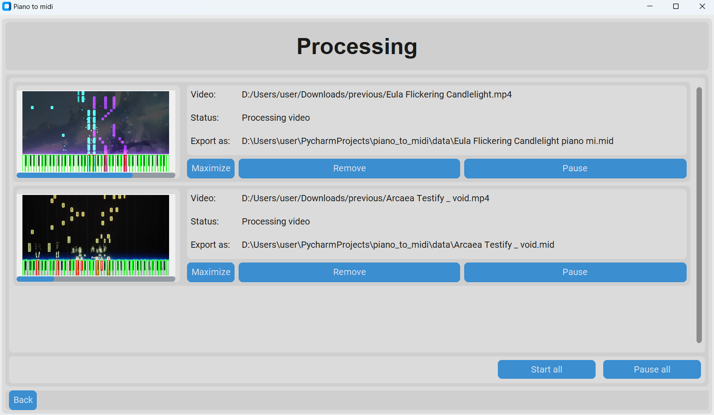

# piano to midi

A project designed to convert piano Synthesia videos into MIDI files.

## Installation

```commandline
git clone git@github.com:stanX19/piano_to_midi.git piano_to_midi
cd piano_to_midi
py -m pip install -r requirements.txt
```

Note: if `py` doesn't work, you might want to replace `py` with `python3`

## Usage

To run the program, execute:

```commandline
py srcs/main.py
```

The program will open a GUI for file selection, supporting multiple files.

## Description

This project uses cv2 to detect piano keys and track changes in BGR values across frames.


### Key Features:

- Extracts video URLs from YouTube playlists.

- Downloads individual videos with customizable settings.

- Processes videos to detect piano key presses.

- Converts detected keypress patterns into MIDI format.

##### Key points:

- The program monitors pixel value changes frame-by-frame, so a higher frame rate will improve accuracy.
- The difference in BGR values per frame (DPF) is stored in `./data/dpf` as cache.
- After processing, the program converts the DPF data into a MIDI file, which is saved by default in the `./data` directory.

## File Structure

```commandline
├───algo                    # main algorithm for converting piano to midi
│   └───utils
├───p2m                     # project specific consants and exceptions
└───ui                      # gui classes
    ├───classes             # different gui components
    │   └───templates
    └───main_frames         # main pages
```

## snapshots


### gui





### gaussian mixture model

